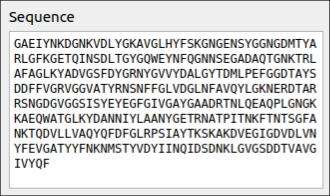

---
title: 'PepFoot User Guide v1.1'
author: Jedd Bellamy-Carter
date: 17 May 2019
...

 This work by <a xmlns:cc="http://creativecommons.org/ns#" href="https://github.com/jbellamycarter" property="cc:attributionName" rel="cc:attributionURL">Jedd Bellamy-Carter</a> is licensed under a <a rel="license" href="http://creativecommons.org/licenses/by-nc-sa/4.0/">Creative Commons Attribution-NonCommercial-ShareAlike 4.0 International License</a>.

User Guide v1.1

This work is licensed under a <a rel="license" href="http://creativecommons.org/licenses/by-nc-sa/4.0/"> Creative Commons Attribution-NonCommercial-ShareAlike 4.0 International License</a>.

PepFoot is intended for analysis and discovery in peptide footprinting, however it may be expanded to encompass more in future releases. PepFoot is released under the [LGPL-3.0 license](https://choosealicense.com/licenses/lgpl-3.0/)

PepFoot is currently maintained by [Jedd Bellamy-Carter, University of Nottingham](jeddidiah.bellamy-carter@nottingham.ac.uk). Any queries or improvements to the
software should be directed there or by submitting an issue on [GitHub](https://github.com/jbellamycarter/pepfoot/issues).

# Getting Started

## Installing PepFoot

The source code and binaries are available for PepFoot on [GitHub](https://github.com/jbellamycarter/pepfoot/releases). Download the appropriate file and follow the below instructions for your operating system.

### Windows

To install PepFoot simply run the `pepFoot_1_1_WinOS.exe` installer and follow the wizard. The full PepFoot GUI should then run without problem.

### MacOSX

To install PepFoot simply mount the `pepFoot_1_1_MacOSX.dmg` file and drag `pepFoot.app` into your `Applications`. The full PepFoot GUI can then be accessed from this app.

### Linux/Python Users

It is recommended to run PepFoot through your local Python3 distribution for security. To install PepFoot simply extract this repository and run `python setup.py install`. This will add the command `pepfoot` to your local Python distribution as well as handle the package dependencies described below. Launching `pepfoot` from a terminal will launch the full PepFoot GUI.

Linux users can add `pepFoot.desktop` to your local `applications` directory and place a copy of `pepFoot.png` in your local `icons` directory. This `.desktop` file can now be used to launch the full PepFoot GUI.

#### Requirements

* [Python 3](https://www.python.org)
* [PyQt >= 5.11](https://www.riverbankcomputing.com/software/pyqt/)
* [matplotlib](https://matplotlib.org/)
* [numpy](https://www.numpy.org/)
* [scipy](https://scipy.org/)
* [pyteomics](https://pyteomics.readthedocs.io/)
* [h5py](https://www.h5py.org/)

[NGL viewer](https://github.com/arose/ngl) is provided by the minified file `ngl.js` that is included with PepFoot.

## Converting raw file to `.mz5`

PepFoot only reads the [`.mz5` data format](https://dx.doi.org/10.1074/mcp.O111.011379) for experimental data. This is due to the open-source nature of this file format, as well as the I/O speeds provided by the HDF5 derived format. The open-source [Proteowizard](http://proteowizard.sourceforge.net/) software allows conversion from all major instrument vendor files to several open-source data formats, including `.mz5`.

# Using PepFoot

## Setting up a Project

Data analysis in PepFoot is handled through projects, simple python dictionaries that are also stored to disk as `.pfoot` files, see [schema](#project-schema). When setting up a project there are two main options: 1. Creating a *New Project*, and 2. Creating a *Project from Template*. Typically you would simply do (1), however this can be tedious for similar experiments. For the same protein system, (2) allows rapid project generation.

### Importing Data Files

Once a project has been created `.mz5` *data files* can be imported in the **Data Files** panel. Files can be added or removed, *Note: The order of files is maintained throughout subsequent processing*.

### Adding FASTA Sequence

Paste a FASTA style sequence (without the `>` line) into the **Sequence** panel. This panel accepts *modX* notation to allow to specific fixed modifications to a given residue, e.g. pS would denote phosphoserine, *Note: This modification overrides other fixed modifications when calculating peptide masses*.

### Choosing Modifications

In the **Modifications** panel multiple fixed modifications *(that are applied to every instance of an amino acid)* may be selected and a single differential modification.

### Setting Digestion Parameters

A variety of parameters can be set for *in silico* digestion including enzyme, peptide length, peptide charge and # missed cleavages in the **Digestion** panel. The default mass tolerance for which peptides are extracted can also be set in the **MS Parameters** panel.

### Begin Exploring the data

The final stage of setting up a project is press the `Explore` button and let PepFoot perform *in silico* digestion and generate parameters for peptides. This is the same function used when examining previously processed data.

## Processing the First File

PepFoot uses a manual-first approach, where the first data file is manually processed before *batch processing* of the remaining data files. Once the project is set-up and `Explore` initiated, PepFoot generates a set of *in silico* peptides and calculates various parameters for them, including mass and isotopic distribution for both unlabelled and labelled variants. The default view is the **Peptide Level** tab, which features a list of theoretical peptides (**Peptides**) and a central plot panel.

### Extracting Peptide Chromatograms

By selecting a peptide in the **Peptides** list, extracted ion chromatograms (EIC) are generated for both unlabelled (*top-left*) and labelled (*top-right*) ions for a given charge state. Above each of these plots is the *m/z* range that has been extracted to produce each EIC. Changing the **Charge State** will generate new EICs. When exploring previously processed data, selecting a peptide will default to the EICs and mass spectra used in processing.

### Extracting Mass Spectra

The default mouse function in the plots is `Zoom`, to generate mass spectra for a given chromatographic region the `Extract` function must be activated *(this can also be done with the `E` key)*. By dragging across a region, the scans within the region will be combined and a mass spectrum generated in the plot below. Once extracted, the mass spectrum is zoomed to a window around the target *m/z* and the theoretical isotope distribution for the peptide is overlaid to aid verification with the error between detected peaks and predicted values shown. A more specific EIC can be generated by dragging across a *m/z* region, this will replace the original EIC plot.

### Integrating Chromatographic Peaks

If a suitable spectrum can be generated for a set of chromatographic peaks, the user can integrate these using the `Integrate` *(`I` key)* function in the same way as extracting. The peaks will be integrated and the *m/z* and retention time ranges stored to the project. If both unlabelled and labelled peptides are observed and integrated the fractional modification is calculated. Once a peptide has been identified and integrated it is marked with a green tick.

## Analysing the Whole Dataset

Once all peptides have been identified and assigned for the first file, the remaining files can now be processed. This is done by pressing the `Batch` button. The batch of files are processed using the parameters set during the initial analysis step by the user. The resulting areas will be stored to the project along with calculated fractional modifications.

### Viewing Fractional Modification

Once the batch process is complete the fractional modification data are loaded from the project and displayed as a histogram and a 2-D protein plot in the **Analysis** tab. A peptide can be selected in either of these plots and the corresponding fractional modification data displayed. A **Threshold** can be set to determine which peptides are significantly labelled. The **Unity** checkbox modifies the appearance of the 2-D plot.

### Grouping by Treatment

For experiments where the data files differ by treatment, i.e. with or without ligand, PepFoot provides a grouping feature. Dragging and moving data files from the **Apo** to the **Holo** widget allows grouping of the data. Pressing **Update** will reprocess the fractional modification data according to these groups and generate a clustered bar plot, where the orange (*left*) bar represents the *apo* group and the blue (*right*) bar represents the *holo* group. A Student's t-test is performed and significantly different bars are overlaid with a dot, the level of significance is determined by the **Significance** box. A **Difference Plot** can also be generated for these data, where the extent of change in modification ($E_m$) is shown.

$$ E_m   = f_{holo} - f_{apo}/ \max \{f_{apo}, f_{holo}\} $$

### Mapping to a 3-D Protein Structure

After footprinting data has been processed PepFoot allows it to be mapped to a 3-D protein structure. To do this the user must provide a `.pdb` file containing the target protein with `Load PDB`, where at least 1 chain must match **exactly** to the amino acid sequence in **Sequence**. The footprinting data are then converted to `b-factor` values and written to the `.pdb` file. **NGL Viewer** is then used to display the `.pdb` with a variety of interactive controls from the mouse and keyboard inputs. The `b-factor` are assigned a value -2, 0, 1 or -1 for residues that are not detected, insignificantly labelled, significantly labelled and significantly exposed (for differential experiments only) respectively. These values are discrete by default but can be stored as a continuous scale for the extent of modification or change by selecting the **Continuous** checkbox. The colour scheme is from Red-Yellow-Blue for `1` to `-1` and Grey for `-2`. As these changes are stored directly in the `.pdb` file, they can be easily shared and coloured in other programs such as PyMOL or Chimera using `b-factor`.

### Exporting Data

In addition to storing footprinting results to `.pdb`, PepFoot also allows export to a `.csv`. This will contain all parameters used in calculating fractional modification results as well as the results including significance measurements. This allows the user to format the data in whichever way they want or perform additional analysis not available in PepFoot.

# Project Schema

PepFoot `.pfoot` files are a human-readable JSON file according to the following schema.

| Key            	|                                                                                  Description 	|
|------------------	|----------------------------------------------------------------------------------	|
| name             	| Project name                                                                     	|
| creation date    	| Creation datetime of project                                                     	|
| data files       	| List of data files [filepath1, filepath2, ...]                                   	|
| sequence         	| Sequence of protein                                                              	|
| length range     	| Peptide length range parameters                                                  	|
| charge range     	| Charge state range parameters                                                    	|
| enzyme           	| Enzyme used for cleavage                                                         	|
| missed cleave    	| Number of missed cleavages                                                       	|
| fixed mods       	| List of fixed modifications applied to protein                                   	|
| differential mod 	| Differential modification applied to peptides                                    	|
| peptides         	| 1xN array of peptide ids e.g. 1-15                                               	|
| m/z array        	| 2xN array of m/z ranges for analysis [[unmod m/z],[mod m/z]]                     	|
| charge array     	| 1xN array of peptide charges                                                     	|
| rt array         	| 2xN array of rt ranges for analysis [[unmod rt],[mod rt]]                        	|
| areas            	| 2xNxM array of area values from analysis [[unmod area],[mod area], ...]          	|
| fractional mod   	| NxM array of fractional modification values from analysis                        	|
| treatment        	| Nested list with indices for data files grouped by treatment [[#, ...],[#, ...]] 	|
| pdb file         	| PDB file associated with project                                                 	|
